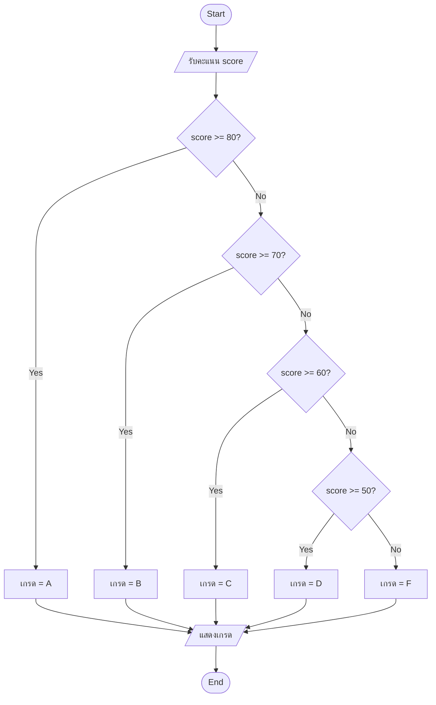
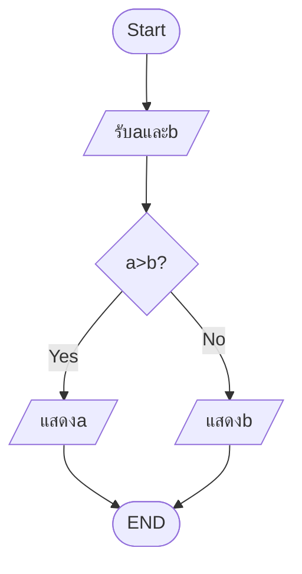
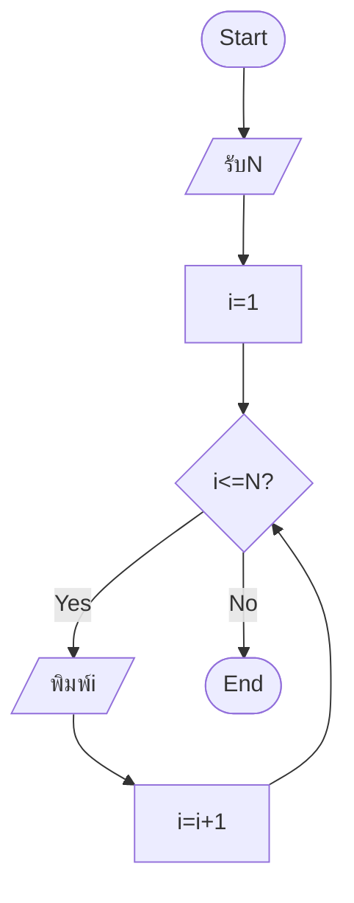
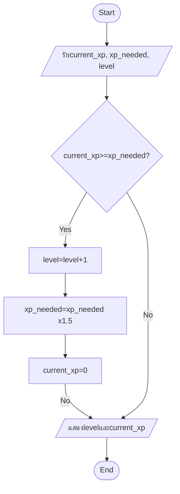
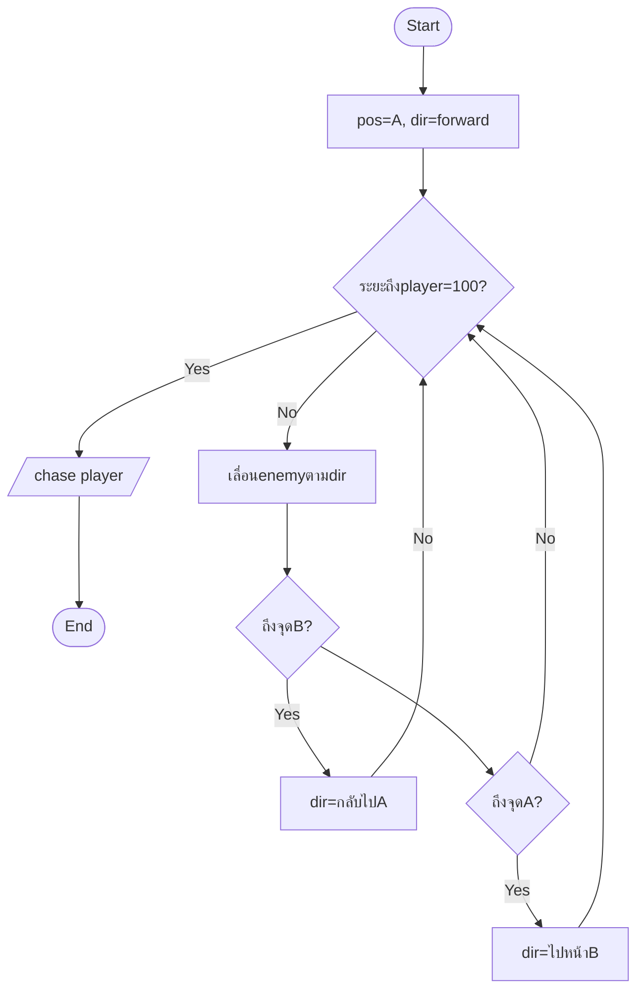

```mermaid
flowchart TD
Start([Start]) --> Input[/รับคะแนน score/]
Input --> D1{score >= 80?}
D1 -->|Yes| A[เกรด = A]
D1 -->|No| D2{score >= 70?}
D2 -->|Yes| B[เกรด = B]
D2 -->|No| D3{score >= 60?}
D3 -->|Yes| C[เกรด = C]
D3 -->|No| D4{score >= 50?}
D4 -->|Yes| D[เกรด = D]
D4 -->|No| F[เกรด = F]
A & B & C & D & F --> Output[/แสดงเกรด/]
Output --> End([End])
```

```mermaid
flowchart TD
Start([Start]) --> Input[/รับaและb/]
Input --> D1{a>b?}
D1 -->|Yes| a[/แสดงa/]
D1 -->|No| b[/แสดงb/]
a & b --> output([END])
```

```mermaid
flowchart TD
Start([Start]) --> Input[/รับN/]
Input --> D1[i=1]
D1 --> a{i<=N?}
a --> |Yes| A[/พิมพ์i/]
a --> |No| B([End])
A --> c[i=i+1]
c --> a
```

```mermaid
flowchart TD
Start([Start]) --> Input[/รับcurrent_xp, xp_needed, level/]
Input --> D1{current_xp>=xp_needed?}
D1 --> |Yes| a[level=level+1]
a --> b[xp_needed=xp_needed x1.5]
b --> c[current_xp=0]
c & D1 --> |No| d[/แสดงlevelและcurrent_xp/]
d --> output([End])
```

```mermaid
flowchart TD
Start([Start]) --> Input[pos=A, dir=forward]
Input --> D1{ระยะถึงplayer=100?}
D1 --> |Yes| a[/chase player/]
a --> a2([End])
D1 --> |No| b[เลื่อนenemyตามdir]
b --> c{ถึงจุดB?}
c --> |Yes| d[dir=กลับไปA]
d --> |No| D1
c --> e{ถึงจุดA?}
e --> |No| D1
e --> |Yes| f[dir=ไปหน้าB]
f --> D1
```
